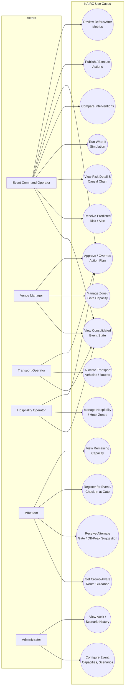

# KAIRO for PS-8 — Winning Plan (Pillai Hackathon)

Team: Byte Alchemy
Base: KAIRO (built for Hack4Innovation / VESIT, PS-SW1) — reused as reference architecture, not resubmitted as-is.

---

## 1. Positioning (team decision, 2026-09-04)

**Team call:** do not proactively bring up the prior Hack4Innovation project to the judges. This pitch is framed as its own build, scoped around event + transportation coordination — genuinely broader than the earlier single-location crowd counter, since this covers zones, gates, transport, hotels and event schedule together.

Pitch framing: "We built a system that consolidates event, venue, transport and hospitality data into one view, predicts pressure before it becomes critical, simulates interventions, and coordinates the response."

**One safety note (not overriding the decision, just flagging it):** if a judge asks directly — "have you built something like this before?" / "isn't this similar to [X]?" — answer honestly rather than deny it. Not volunteering the connection is a reasonable choice; denying it outright if asked point-blank is the version that actually causes problems. Have a short honest line ready just in case (see Q&A Prep, Section 8).

---

## 2. Plagiarism / originality — do these before submission

- [ ] Remove every leftover `citeturn0search...` artifact in the SRS (currently in Executive Summary, Section 2, Section 3, Section 9.2, Section 22, Section 22.1/final). Convert Section 30 into real numbered footnotes and reference them as `[1]`, `[2]`, etc.
- [ ] Rewrite the CrowdShield / Drishti / Arenix / ServiceNow descriptions (Sections 3, 22, 30) in your own sentence structure — currently too close to the source abstracts/READMEs for a similarity checker to ignore.
- [ ] Any verbatim sentence from the official PS-8 brief should be a clearly marked quote with attribution, not blended into your own Executive Summary / Problem Definition prose.
- [ ] Run the final report text through a similarity checker (Copyleaks/Quetext/Turnitin if your college has access) before submitting — check the competitor-analysis and problem-definition sections specifically.
- [ ] Check Pillai's hackathon rules for any "prior work" / "no resubmission" clause, just so there are no surprises — team decision is not to volunteer the Hack4Innovation connection, but answer honestly if asked directly (Section 1).

---

## 3. AI — this event scores on AI, so make it real and visible, not decorative

Judges will discount AI that's just a labeled box in an architecture diagram. Make these visibly work in the demo:

- **Crowd forecast = LSTM, not a rule-based baseline.** The SRS's default MVP plan says "rule/time-series baseline" for demand forecast (Section 8) — upgrade this to your LSTM approach from KAIRO. This alone is a believable, defensible AI claim because you've already built it once.
- **Flow tracking = GNN.** Use the GNN to model zones as a graph (nodes = gates/zones, edges = walkways/routes) and show it detecting a specific unusual flow (e.g., a zone's inflow abnormally spiking relative to neighbors) — this is a concrete, demonstrable "AI found something a human dashboard wouldn't."
- **Fusion layer (new, and a genuine differentiator).** None of the competitor systems you cite (CrowdShield, Drishti, Arenix) fuse crowd + transport + hotel + schedule into one feature vector before scoring risk — they're crowd-only. Build this fusion step explicitly and name it in the pitch: "we don't just watch the crowd, we combine five live signals before deciding anything is a risk."
- **Risk Engine stays deterministic/weighted (Section 8.2 formula)** — keep this NOT framed as "AI" in the pitch. Judges increasingly penalize teams that call every formula "AI." Be precise: ML for forecasting/tracking, deterministic scoring + optimization for the decision layer, LLM only for explanation (Section 8.1's AI boundary is your friend here — repeat it explicitly to judges as a design choice, not a limitation).
- **LLM copilot: make it explain a real recommendation live.** E.g., operator clicks a risk → LLM turns the structured JSON causal chain (session ends → Gate 2 inflow → Corridor B overload) into one plain-English sentence. Ground it strictly in your structured data (Section 8.1) and say so out loud — "the LLM cannot invent a number, it can only narrate ours." This directly pre-empts the "isn't this just an LLM wrapper" question.
- **Show one before/after number that came out of an actual run of your code**, not a slide with invented percentages. Even one real simulated scenario beats five illustrative ones.

AI checklist for the demo:
- [ ] Live LSTM forecast plotted against actual synthetic ground truth (even a small chart proves it's not hardcoded)
- [ ] GNN/graph view of zones with at least one live-highlighted abnormal edge/flow
- [ ] Fusion state vector shown on screen at the moment a risk fires (make the multi-source input visible, not hidden)
- [ ] LLM explanation box tied to a real risk object, with a visible "grounded in: [zone data, transport data]" tag
- [ ] One real what-if run, before/after numbers pulled from your own simulator output

---

## 4. UI — build for what a judge sees in under 3 minutes

You have ~14 screens in the SRS (Section 13). Do NOT build all of them. Build these three well, and let everything else be a static mock or missing:

1. **Command Center (S02)** — this is the hero screen. One glance shows: attendee count, critical risks list, predicted-next-15-min mini panel. Reuse KAIRO's Mapbox/3D map instinct here if time allows — a live map with a color-coded zone (green/yellow/orange/red, per the "Dynamic Risk Heatmap" feature in the SRS enhancement) reads as far more impressive on a projector than a table of numbers.
2. **What-If Simulator (S07)** — the signature feature per the SRS itself (Section 15). A judge should be able to watch a slider/button change and see numbers move in under 2 seconds (NFR-02 target). This is the single highest-leverage screen to get right — it's the thing no basic crowd-monitoring dashboard has.
3. **Risk Detail / causal chain (S05)** — even a simple visual chain (Gate 2 → Corridor B → Hotel A, as in Section 415 of the SRS) makes the "we trace downstream effects" claim tangible instead of a bullet point.

UI principles for a hackathon judge (not a production user):
- Color communicates risk state at a glance (green/yellow/orange/red) — don't make them read text to know if something is bad.
- Before/after must be side-by-side on one screen, not two separate views a judge has to remember and compare mentally (Section 5 of the SRS enhancement already frames this correctly — "make before vs after the centerpiece").
- Motion/animation on the map when a scenario runs reads as "live system," a static refresh reads as "slideshow."
- Attendee-facing screen (S10) can be a single polished mobile mockup — you do not need a working app, one convincing screen recording is enough and lower risk than live-demoing two separate apps.
- Skip: Admin (S14), full Analytics (S13), Execution Monitor (S09) as anything beyond a mock — they don't move the needle with judges and burn build time.

---

## 5. Priority build order (assumes a 2-day/48h window per the SRS's own plan, Section 23)

1. Freeze one scenario + synthetic dataset (event, zones, transport, hotels — Section 9.1 sizing: 8-12 zones, 3-5 routes, 10-20 hotels)
2. Crowd state + fusion layer (reuse/adapt KAIRO detection+fusion code)
3. LSTM forecast + GNN flow tracking (reuse/adapt KAIRO models, retrain/tune on new synthetic zones)
4. Risk Engine (Section 8.2 formula) — deterministic, get this rock solid and explainable
5. What-If Simulator (Section 15) — the signature feature, do not skip or under-build this. Must genuinely recompute from arbitrary input (see Section 8 Q&A), and must reject/re-score a redirect target that's itself near capacity — not just accept any input blindly.
6. Orchestration/Action Optimizer (Section 16) — ranked action plan output. Must filter candidate actions against real resource-quantity fields (buses/staff/gates actually available) before scoring — don't let it rank an action using a resource that doesn't exist in the data.
7. Command Center UI wired to real backend state (not mocked)
8. LLM explanation layer, grounded strictly in structured data
9. Risk Detail causal-chain view
10. Polish: color states, before/after panel, one attendee-view mockup, demo script rehearsal (Section 26 already has a good script — rehearse it exactly)

**Parallel track (not blocking the above):** Registration & Check-In (Section 7.2) — a form + generated code + check-in counter with capacity check. Low effort, doesn't depend on the camera pipeline, and is your safest fallback crowd-count source if the phone camera/WiFi has any trouble on demo day.

Cut list if time runs out (per SRS Section 23.1): 3D twin, real hotel/transport APIs, full mobile app, anything beyond one killer scenario.

---

## 6. Use Case Diagram

Actors (from SRS Section 5) and their use cases (from Sections 6 & 7). Mermaid version first (renders in GitHub/VS Code/most markdown viewers), plain-text version below it as a fallback for slides/print.



Plain-text fallback:

```
                         +-------------------------------+
                         |            KAIRO               |
                         |                                 |
  Event Command   ------>|  View Consolidated Event State |
     Operator     ------>|  Receive Predicted Risk        |
                  ------>|  View Risk Detail/Causal Chain |
                  ------>|  Run What-If Simulation        |
                  ------>|  Compare Interventions         |
                  ------>|  Approve / Override Plan       |
                  ------>|  Publish / Execute Actions     |
                  ------>|  Review Before/After Metrics   |
                         |                                 |
  Venue Manager   ------>|  Manage Zone/Gate Capacity      |
                  ------>|  Approve / Override Plan  (*)   |
                         |                                 |
  Transport       ------>|  Allocate Vehicles / Routes     |
    Operator      ------>|  Approve / Override Plan  (*)   |
                         |                                 |
  Hospitality     ------>|  Manage Hotel/Hospitality Zones |
    Operator      ------>|  Approve / Override Plan  (*)   |
                         |                                 |
  Attendee        ------>|  Get Crowd-Aware Route Guidance |
                  ------>|  Receive Alternate Gate/Off-Peak|
                  ------>|  Register / Check In at Gate    |
                  ------>|  View Remaining Capacity        |
                         |                                 |
  Administrator   ------>|  Configure Event/Capacities     |
                  ------>|  View Audit/Scenario History    |
                         +-------------------------------+

  (*) shared use case — each operator role can approve/override
      actions scoped to their own resource domain.
```

Use this diagram directly in the report/slides to visually back up Section 5 (Stakeholders & Personas) and Section 7 (Workflows) of the SRS — judges respond well to seeing the actor/use-case relationships instead of only reading a persona table.

---

## 7. Crowd count sourcing — where the numbers actually come from

Four sources feed `crowd_snapshots`, layered so the demo never depends on one thing working live:

1. **Real detection (where you have video)** — run the YOLOv8 model from `crowd-prediction-ai` on a video feed per zone → outputs a person count per frame; sampling count over time also gives inflow/outflow (feeds the GNN tracking piece).
2. **Synthetic generator (for zones without footage)** — a deterministic script producing a plausible count-over-time curve per zone (e.g., ramps toward a scripted "session ends" spike). Deterministic = same scenario always produces the same numbers, which NFR-03 in the SRS already requires for a reliable demo. The SRS's own dataset sizing (Section 9.1) assumes this for most of your 8-12 zones.
3. **Manual/admin override** — an Administrator panel to directly set/nudge a zone's count or fire a pre-built scenario ("trigger session-release spike") with one click. This is what you actually click live in front of judges — same idea as the "SIMULATE SESSION RELEASE" button in the demo script (Section 26) — and it's also a legitimate product answer to "what about a gate with no camera yet."
4. **Registration & check-in (see 7.2)** — a real, confirmed headcount from people actually registering/checking in, independent of any camera or network.

All four write to the same `crowd_snapshots` table (SRS Section 10), so the Risk Engine/LSTM/GNN downstream never need to know which source a number came from. Say this to judges: "the pipeline is source-agnostic — real cameras, manual input, or confirmed check-ins all feed the same state."

**Recommended demo mix:** 1 zone on real detection, remaining zones on the synthetic generator, admin "trigger scenario" button layered on top of both.

### 7.1 Using a phone as the live camera (desktop app, phone as sensor)

The app can run entirely on the desktop browser while the camera itself is a phone — the phone is just another video source, not a client of the app.

**Setup (Option A — IP camera app, ~15 min, no custom code):**

1. Install an IP-camera app on the phone: **IP Webcam** (Android, free) or **iVCam/DroidCam** (iPhone, needs a small desktop companion app).
2. Put the phone and desktop on the same network — same WiFi, or phone hotspot with the desktop connected to it (works even with bad venue WiFi).
3. On the phone, open the app and tap "Start server" — it shows a URL like `http://192.168.1.42:8080`. Open that URL in the desktop browser first to confirm you see the live video before wiring it into code.
4. Point the existing YOLO script at the stream URL instead of a file:
   ```python
   import cv2
   from ultralytics import YOLO

   model = YOLO("yolov8n.pt")  # already have this file
   cap = cv2.VideoCapture("http://192.168.1.42:8080/video")  # phone stream, not a file path

   while True:
       ret, frame = cap.read()
       if not ret:
           break
       results = model(frame, classes=[0])  # class 0 = person
       count = len(results[0].boxes)
       # push `count` into crowd_snapshots for this zone, same as the video.mp4 path
   ```
   This is a one-line swap from whatever currently points at `video.mp4` — no other pipeline code changes.
5. Keep a fallback: gate the source behind a config flag so you can flip back to `video.mp4` instantly if venue WiFi drops mid-demo, without editing code live.
6. Test once at the actual venue if possible — disable the phone's auto-lock/screen-lock (it kills the stream) and confirm the network holds before relying on it in front of judges.

**Option B (more build time, more original)** — phone opens your own web page, JS `getUserMedia()` captures frames, uploads JPEGs to a backend endpoint every ~300-500ms, backend runs YOLO on each upload. Fully your own code (no third-party app dependency) and doubles as a good answer to "how would this scale without installing hardware" (ties to SRS Section 24 production roadmap), but only build this if Option A is solid and time remains.

### 7.2 Registration & Check-In (a real headcount source, not just an estimate) — BookMyShow-style, simplified

This is the most trustworthy count source you have, because it's a confirmed number, not a computer-vision estimate — and it doesn't depend on a camera or WiFi at all, so it can't lag or drop like the phone stream can. Use YOLO as the "AI showcase" layered on top of this, not as the only thing standing between you and a working number.

**Scope guardrail:** the SRS explicitly lists "Real payment/ticketing" under Non-Goals for 48 Hours (Section 2.2). Do **not** build a real ticketing/payment platform. Build only: a registration form, a generated code, and a check-in action that increments a counter. That's a few hours of work, not a ticketing platform.

**1. Pre-event registration**
- Simple form: name + which session/gate the attendee plans to use. No payment.
- Feeds `visitor_profiles` and `event_sessions` (already in the DB schema, Section 10) with real advance-demand numbers — genuinely useful for the LSTM forecast, since right now it only sees historical + live data, not advance signals of who's actually coming.
- Generates a QR code / short code per registration, used at check-in.

**2. Walk-in / on-the-spot registration at the gate**
- Not everyone pre-registers. Gate staff (or a self-service kiosk/tablet) can register a walk-in attendee on arrival with the same minimal form (name + auto-assign to that gate) — this still produces a check-in event, it's just created at arrival instead of in advance.

**3. Gate check-in**
- On arrival, the attendee's code is scanned (or gate staff taps a "check-in" button) → increments that gate's real inflow count at that exact timestamp, written straight into `crowd_snapshots.inflow`.
- This is a genuine ground-truth number you can use to **validate the YOLO count live** — e.g., "our vision model estimates 240 people at Gate 2, check-in data confirms 235 — a strong accuracy story, not just a claim.

**4. Capacity-based prevention at check-in**
- Before confirming a check-in, check current count for that gate/zone against `safe_capacity` (same Utilization formula already in SRS Section 14: `Utilization = current_count / safe_capacity`).
- If a gate is at/near capacity: don't hard-block silently — **redirect**, consistent with the rest of the system's philosophy (recommend, human stays in control). Options, easiest first:
  - Soft warning to gate staff ("Gate 2 is at 95% — consider directing new arrivals to Gate 3") — staff decides, matches your human-approval principle.
  - Auto-suggested alternate gate shown to the attendee at check-in (ties directly into FR-07/FR-13 "recommend alternate gate" — this is that feature, just triggered from check-in instead of only from the operator's Command Center).
- This is a genuine "prevent," not just "predict" — worth saying explicitly to judges: "check-in isn't just counting people in, it's the one place we can actually stop overcrowding before it happens, not just alert about it afterward."

**5. Remaining-capacity visibility**
- Operator side: show `safe_capacity - current_count` per gate/zone on the Command Center (trivial addition, same formula, Section 14).
- Attendee side: a simple "X spots remaining at Gate 2" indicator — feeds the same alternate-gate/off-peak recommendation already planned for the attendee view (S10, FR-14) and gives attendees a reason to actually use the app before they even arrive.

**Where this plugs into the rest of the plan:**
- Adds two new use cases for the Attendee actor (Section 6): *Register / Check In at Gate*, *View Remaining Capacity*.
- Priority build order (Section 5): treat this as a parallel, lower-effort track — a form + QR/code + check-in counter — buildable alongside the camera pipeline rather than blocking on it, and it's your safest fallback if the camera/network story has any trouble on demo day.

---

## 8. Q&A Prep — team's answers

Cleaned-up answers based on the team's own positions (2026-09-04). Use these as talking points, not a script to read word-for-word.

**Reuse / originality**
- Not brought up proactively — pitch is framed as its own build (event + transport + hospitality coordination), which is genuinely broader in scope than a single-location crowd counter.
- If asked directly: answer honestly rather than deny it (see Section 1).

**Crowd count & data credibility**
- *Is the count real or simulated?* Where a camera is used, it's real (live YOLO detection). Where it isn't, it's our own synthetic dataset.
- *Why synthetic data?* Because no existing dataset combines every field this system needs (crowd + transport + hotel + schedule together) — there was no real option, so we built it ourselves.
- *How accurate is detection on dense/overhead crowds?* We use YOLO rather than plain OpenCV because it performs better at person detection. Performance at very high density or extreme camera angles hasn't been stress-tested yet — an open item, not something to overclaim.
- *Does it scale to many zones/cameras without lag?* Process frames intermittently (not every frame) and push heavier detection work to edge computing near each camera rather than one central server — this is the same mitigation the team already identified in the original KAIRO deck, not a new gap.

**AI/ML depth** (say the plain-English line first — every judge should follow it, technical or not; the term in brackets is just there in case someone technical asks "what's that called")

- *Why LSTM?* "We look at how the crowd built up over the last several hours, plus the time of day and whether it's a weekend or a special event — and use that pattern to guess what's coming next. It's the same idea as knowing Friday evenings are always busier than Tuesday mornings, except the system spots the pattern automatically and warns us before it happens instead of after." [This part of the AI is called an LSTM — it's designed to learn from things that happen in a sequence over time.]
- *What does the GNN represent?* "Picture the venue as a map of connected areas — gates, walkways, hotels nearby. This part of the AI understands how those areas affect each other, so if one gate gets crowded, it can tell us which connected area is likely to feel it next — the same way traffic backing up at one junction slows down the next one over." [This is called a GNN, a graph neural network — "graph" here just means a map of connected points.]
- *Where do the risk-formula weights come from?* "We built our scoring so that what's happening right now — how full a place actually is at this exact moment — always counts the most. Past patterns and how connected areas affect each other matter too, but they count for less than the current, real situation." [Current occupancy carries the highest weight, 0.35, in our formula.]
- *What stops the AI assistant from making things up?* "The part of our system that explains things in plain language is only allowed to describe numbers our own system has already calculated — it can put a decision into words, but it can never invent a fact or a number on its own." [This is the LLM explanation layer — grounded strictly in our structured data, by design.]
- *Do you have accuracy numbers?* "We're upfront that this is a working prototype tested on our own practice data — not something certified or proven in a real, live event yet." Don't claim real-world accuracy.

**System edge cases**
- *What if two interventions conflict (e.g. redirecting into an already-full zone)?* The system checks downstream capacity before recommending anything — it won't suggest sending people into a zone that's also near its limit. **Must actually be implemented** (see build checklist below) — this only survives a live "prove it" question if the simulator genuinely rejects/re-scores a redirect target that's over capacity, not if it's just a spoken claim.
- *What if the optimizer recommends a resource you don't have?* It's constrained to resources the operator actually owns — it only recommends from real, available inventory (buses, staff, gates), not hypothetical ones. **Must actually be implemented** — filter candidate actions against a real resource-quantity field before scoring/ranking them, not just describe the constraint verbally.
- *What if the LLM/API is unavailable?* Structured fallback — the deterministic risk engine and simulator keep working without it; only the plain-language explanation is missing.

**Business / feasibility**
- *Who pays?* Free for event organizers, for now. Camera hardware cost is near-zero since phones are used as sensors. Revenue comes from hotel and transport partners — but structured as a **commission on a successful outcome** (a completed referral/booking/dispatch that resulted from a recommendation), not a flat pay-to-be-recommended fee. This matters: if partners paid just to be featured, it would contradict the system's own "AI must not bias or invent recommendations" design principle (Section 8.1) — a judge will ask exactly that. Keep the ranking/recommendation logic itself blind to who pays; monetize only after a real outcome, same model as travel-booking referral fees.
- *How is this different from just hiring more staff?* More staff means more ongoing cost and more management overhead. This is a cheaper, faster, software-based way to get the same visibility and response.
- *How would a customer actually use this?* (not an abstract "path to a customer" — the actual flow): the organizer sets up an event by entering details — expected attendance, number of gates, venue layout — and the system uses that from day one to track pressure and help manage it.

**Ethics / safety**
- *Are you storing or recognizing faces?* No face recognition, no personal data — only aggregate people counts.
- *If a prediction is wrong during a real emergency, who's responsible?* We're upfront that it's AI and can make mistakes — that's exactly why a human approval step exists before any action is executed.
- *Doesn't human approval slow things down?* The small delay is worth it — it can stop a wrong decision before it's acted on. That's a safety feature, not a flaw.

**Live-demo traps**
- *Can you trigger a scenario I (the judge) choose?* Yes — plan to actually do this live: set the event and current count, open the camera, and show prediction + prevention happening in real time, not just a rehearsed run.
- *Is the what-if simulator actually recalculating, or just switching between two pre-baked screens?* **Build it so this is never a hard question:** the simulator must take arbitrary input (e.g., a redirect-percentage slider or typed number) and recompute the risk formula live from that input — not swap between two fixed pre-rendered states. If it's built this way, the answer is simply: "pick any number, not the one we rehearsed with, and watch it recalculate." Then let the judge actually type a value in and show it responding — that's more convincing than any verbal answer.
- *What if your phone camera fails right now — show me the fallback?* This is already covered by the setup in Section 7.1, step 5 — keep a config flag/toggle that switches the crowd-count source from the live phone stream to the backup recorded video (`video.mp4`) instantly, with the rest of the pipeline (YOLO → risk engine → Command Center) untouched. Rehearse actually flipping this switch once beforehand so it's not the first time you've done it live — the answer becomes an action ("here, watch") instead of an excuse.

---

## 9. One-line differentiators to repeat to judges

- "We fuse five live signals — crowd, transport, hotels, schedule, venue capacity — before we decide anything is a risk. Competitors we researched are crowd-only."
- "Our AI is layered on purpose: ML forecasts, deterministic rules decide, LLM only explains — so the system can never invent a fact under pressure."
- "The what-if simulator is not a mockup — click it, and you see our own risk formula move in real time against our own data."
